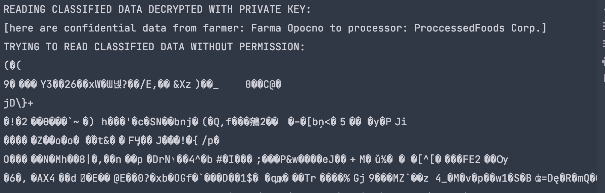

# Food chain project

## Design patterns used so far

1. Singleton (`Government` class)
1. Lazy initialization (`Government` class)
1. Builder (`Node` class)
1. Strategy (`TaxPolicy` class)
1. Factory Method (`Farmer`)
1. Map, filter pattern (`Product`)

## Tried so Far

1. Global log to file
1. Save info already encrypted, read only with private key, with no key gibberish (img below)
1. Sign message
1. Transactions

